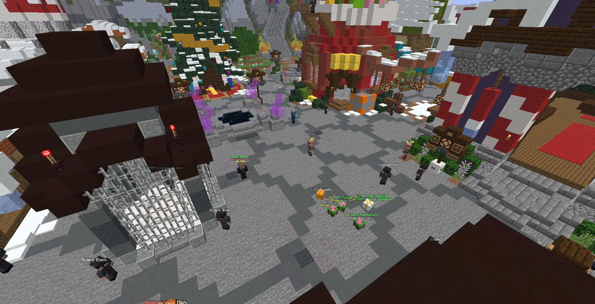
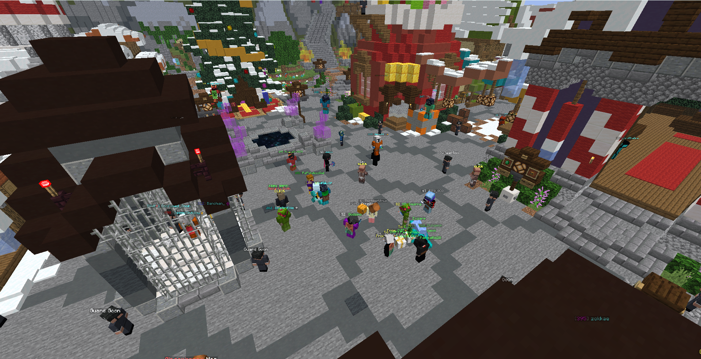
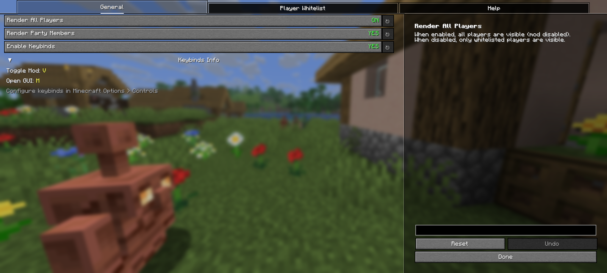
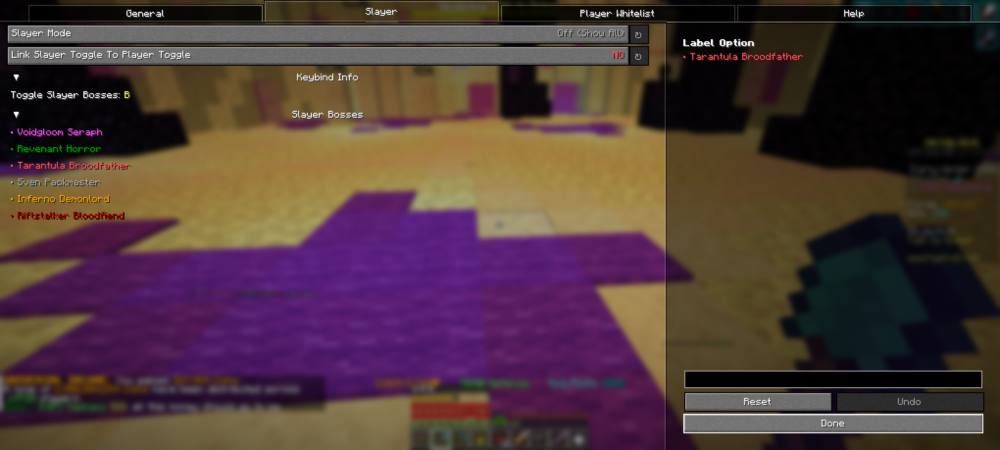
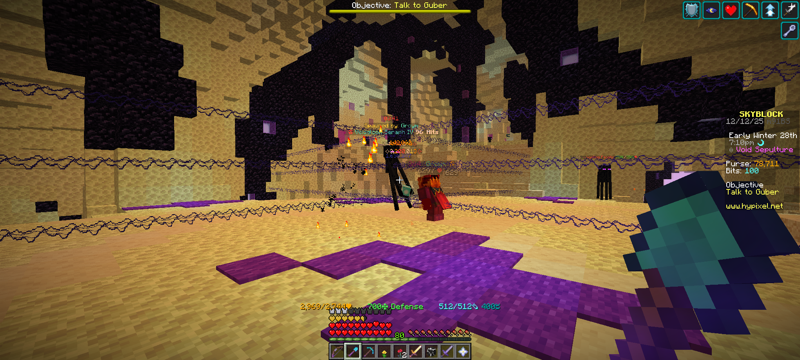
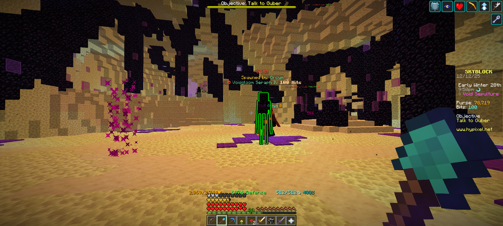
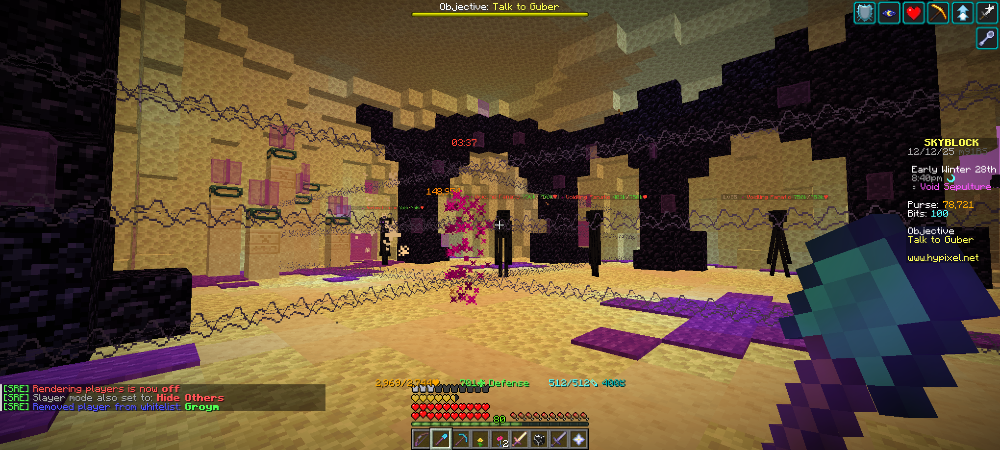
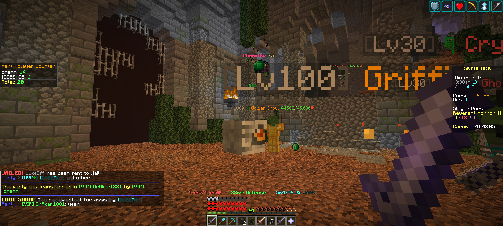

# Skyblock Render Enhanced (SRE)

[](https://modrinth.com/mod/skyblocker-render-enhanced)


A lightweight **Fabric mod** for **Hypixel Skyblock** that hides all players except the ones you choose.  
Perfect for **hub drops**, **foraging**, **slayer bosses**, **end lobbies**, or any area where too many players cause visual clutter.

---

## Screenshots

### Player Render OFF  
A crowded hub where all other players are hidden.



---

### Player Render ON  
Players are visible again after toggling.



---

### Configuration GUI  
Clean and simple settings menu powered by YACL (Yet Another Config Lib).



### Slayer Config GUI



### Slayer Normal Mode



### Slayer Highlight Mode



### Slayer Hide Mode



### Counter Widget



### Counter Config GUI


---

## Features

### Player Hiding  
Hide all players except those you've added to your allowlist.

### Whitelist System  
Keep specific players **always visible**, even when hiding everyone else.

### Slayer Boss Management
Control visibility of slayer bosses with multiple modes:
- **Off**: Show all slayer bosses (feature disabled)
- **Hide**: Hide other players' slayer bosses, show yours and party/whitelisted players' bosses
- **Glow**: Highlight your, party members', and whitelisted players' slayer bosses with a glow effect

Supported Slayer Bosses:
- Voidgloom Seraph
- Revenant Horror
- Tarantula Broodfather
- Sven Packmaster
- Inferno Demonlord
- Riftstalker Bloodfiend

### Party Slayer Counter (NEW in v1.0.4)
Track how many slayer bosses you've killed for party members - perfect for slayer carries!

**Two Counting Modes:**
- **Auto Mode**: Automatically detects and counts kills when you receive "LOOT SHARE" messages + allows manual adjustments
- **Manual Mode**: You count everything yourself using commands

**How it works:**
1. Enable the counter in settings or with `/sre toggle counter`
2. Choose your mode: Auto or Manual (via GUI or `/sre counter mode`)
3. In Auto mode: kills are counted automatically when you help kill party members' bosses
4. Use `/sre counter add <player>` to manually add kills
5. Use `/sre counter remove <player>` to manually subtract kills (fix mistakes!)
6. View counts with `/sre counter` command or the on-screen widget
7. Widget position is fully customizable - drag it anywhere with `/sre widget`
8. Data is saved to cache and automatically clears when party disbands

**Why you need this:**
- Perfect for slayer carries where you kill bosses for paying customers
- Track exactly how many bosses you've done for each party member
- Manual adjustment for when auto-detection misses or double-counts
- Never lose count even after hundreds of boss kills!

### Beautiful Config GUI (YACL)  
All settings can be controlled from a clean configuration menu powered by YACL.

### Clean Command System  
Simple, modern `/sre` commands for full control.

### Keybind Support  
Quickly toggle the renderer or open the GUI without typing commands.

### Automatic NPC Detection  
NPCs remain visible, so nothing important disappears.

### Party Member Support  
Automatically render Hypixel party members - perfect for Diana events and slayer parties!

### Lightweight & Skyblock-Friendly  
Runs smoothly even in the busiest lobbies.

---

## Installation

1. Install **Fabric Loader 0.18.2+** for Minecraft 1.21.10  
   https://fabricmc.net/use/installer/

2. Install **Fabric API**  
   https://modrinth.com/mod/fabric-api

3. Download **Skyblock Render Enhanced** from Modrinth:  
   https://modrinth.com/mod/skyblocker-render-enhanced

4. Place the `.jar` file inside:  
   `.minecraft/mods/`

5. Launch Minecraft using the Fabric profile.

---

## Usage

### Commands

| Command | Description |
|--------|-------------|
| `/sre` | Open the config GUI |
| `/sre help` | Show list of commands |
| `/sre toggle player` | Toggle player rendering on/off |
| `/sre toggle slayer` | Cycle slayer mode (Off/Hide/Glow) |
| `/sre toggle counter` | Toggle party slayer counter on/off |
| `/sre counter` | Show party slayer kill counts |
| `/sre counter mode` | Toggle between Auto and Manual mode |
| `/sre counter add <player>` | Add +1 kill for a player |
| `/sre counter remove <player>` | Remove -1 kill for a player |
| `/sre counter clear` | Clear counter data |
| `/sre widget` | Open widget position editor |
| `/sre whitelist add <player>` | Add player to whitelist |
| `/sre whitelist remove <player>` | Remove player from whitelist |

---

### Keybinds

(Default, customizable under **Controls > Keybinds**)

| Key | Action |
|-----|--------|
| `M` | Open SRE config GUI |
| `V` | Toggle player rendering on/off |
| `B` | Cycle slayer mode |

---

## Building from Source

```bash
git clone https://github.com/akar1881/skyblock-render-enhanced.git
cd skyblock-render-enhanced
./gradlew build
```
The compiled JAR will appear in:
build/libs/

---

## Requirements

- Minecraft 1.21.10
- Fabric Loader 0.18.2+
- Fabric API
- Java 21+

---

## Credits

- Inspired by SRP (Select Player Renderer) by Syfe
- Fully rewritten for Fabric 1.21.10 with YACL
- Developed by akar1881

---

## License

This project is licensed under the GPL 3.0 License.
