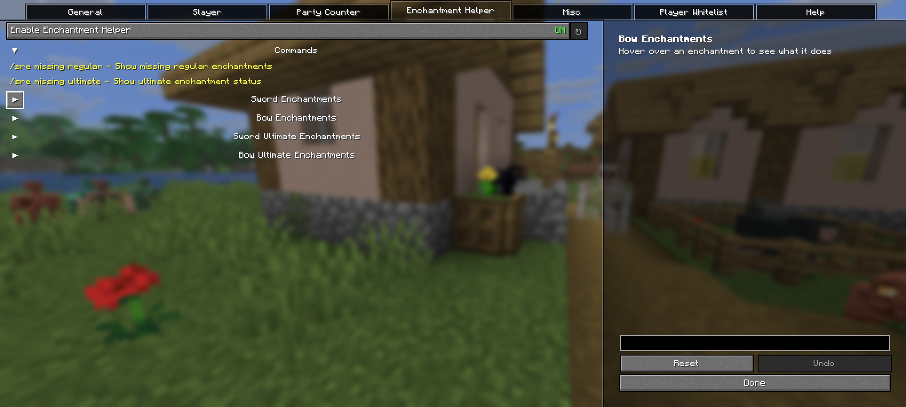
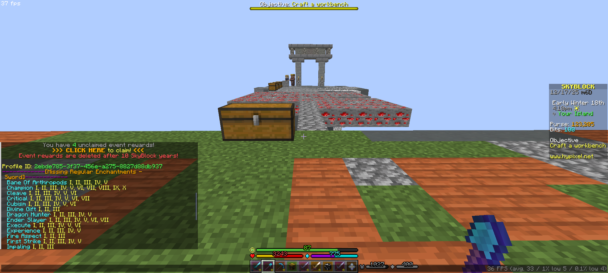
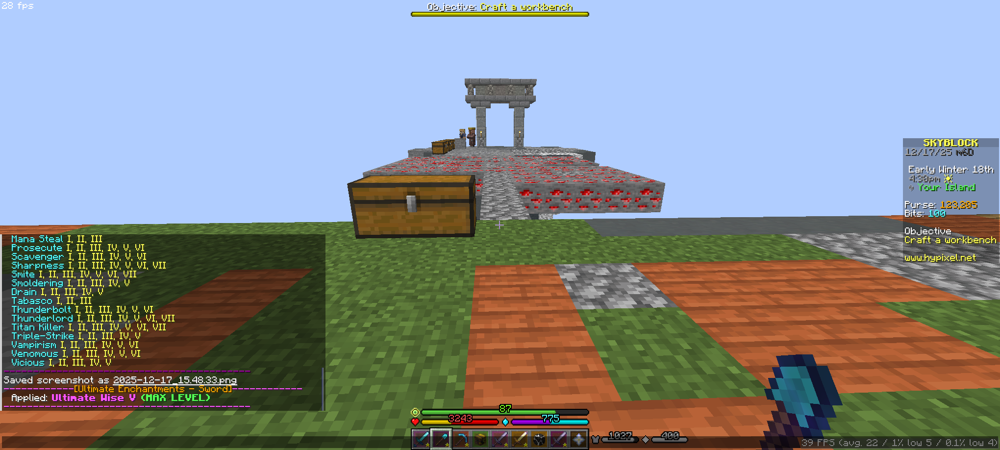
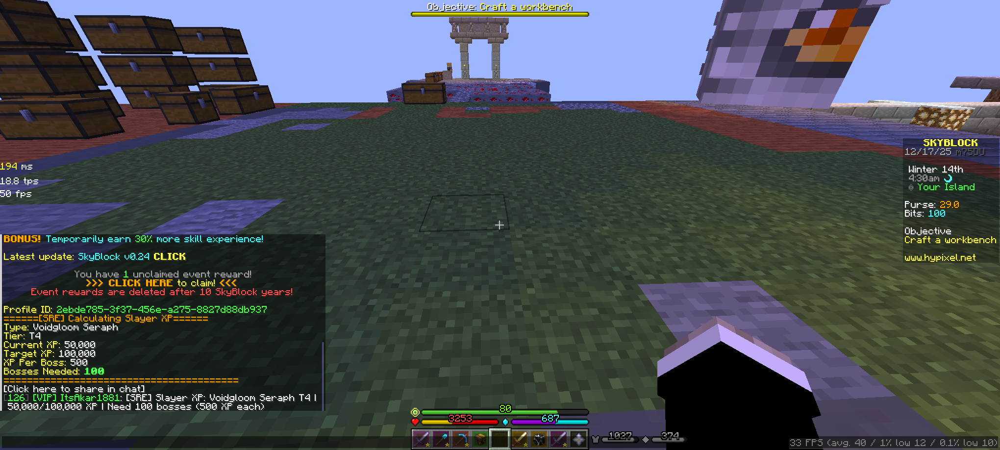

# Skyblock Render Enhanced (SRE)

[](https://modrinth.com/mod/sre)


A lightweight **Fabric mod** for **Hypixel Skyblock** that hides all players except the ones you choose.  
Perfect for **hub drops**, **foraging**, **slayer bosses**, **end lobbies**, or any area where too many players cause visual clutter.

---

## Screenshots

### Player Render OFF  
A crowded hub where all other players are hidden.


---

### Player Render ON  
Players are visible again after toggling.


---

### Configuration GUI  
Clean and simple settings menu powered by YACL (Yet Another Config Lib).


### Slayer Highlight Off


### Slayer Highlight On


### Enchantment Helper GUI



### Regular Enchantment Helper



### Ultimate Enchantment Helper



### Calculator SLAYER/XP 



---

## Features

### Player Hiding  
Hide all players except those you've added to your allowlist.

### Whitelist System  
Keep specific players **always visible**, even when hiding everyone else.

### Slayer Boss Management
Control slayer boss highlighting with two modes:
- **Off**: Show all slayer bosses without highlight
- **On**: Highlight your, party members', and whitelisted players' slayer bosses with a glow effect

Supported Slayer Bosses:
- Voidgloom Seraph
- Revenant Horror
- Tarantula Broodfather
- Sven Packmaster
- Inferno Demonlord
- Riftstalker Bloodfiend

### Slayer Spawn Alert
Get instant notifications when a slayer boss spawns!

**Features:**
- Displays a chat message alert when a slayer boss spawns (for your own or party members' bosses)
- Plays a notification sound to grab your attention instantly
- Automatically enabled/disabled based on your settings
- Perfect for group slayer runs - never miss a spawn again!

**How it works:**
- Enable in the Slayer settings GUI
- When you or a party member spawns a boss, you'll see a message like: "[SRE] Boss Spawned: Slayer Boss by PlayerName"
- A distinctive sound effect plays to notify you immediately
- Works with all supported slayer types

### Party Slayer Counter 
Track how many slayer bosses you've killed for party members - perfect for slayer carries!

**Two Counting Modes:**
- **Auto Mode**: Automatically detects and counts kills when you receive "LOOT SHARE" messages + allows manual adjustments
- **Manual Mode**: You count everything yourself using commands

**How it works:**
1. Enable the counter in settings or with `/sre toggle counter`
2. Choose your mode: Auto or Manual (via GUI or `/sre counter mode`)
3. In Auto mode: kills are counted automatically when you help kill party members' bosses
4. Use `/sre counter add <player>` to manually add kills
5. Use `/sre counter remove <player>` to manually subtract kills (fix mistakes!)
6. View counts with `/sre counter` command or the on-screen widget
7. Widget position is fully customizable - drag it anywhere with `/sre widget`
8. Data is saved to cache and automatically clears when party disbands

**Why you need this:**
- Perfect for slayer carries where you kill bosses for paying customers
- Track exactly how many bosses you've done for each party member
- Manual adjustment for when auto-detection misses or double-counts
- Never lose count even after hundreds of boss kills!

### Slayer Carry Calculator 
Calculate prices and XP requirements for slayer carries!

**Price Calculator:**
- `/sre counter math slayer <type> <tier> <price> <amount> [discount%]`
- Calculates total price with optional discount
- Click to share the calculation in chat with [SRE] branding

**XP Calculator:**
- `/sre counter math xp <type> <tier> <currentXP/targetXP> [xpPerBoss]`
- Calculates how many bosses you need to reach your target XP
- Optional: Specify custom XP per boss at the end (uses default tier XP if not specified)
- Click to share the calculation in chat with [SRE] branding

**Supported Slayer Types:**
- Voidgloom Seraph (T1-T4)
- Revenant Horror (T1-T5)
- Tarantula Broodfather (T1-T4)
- Sven Packmaster (T1-T4)
- Inferno Demonlord (T1-T4)
- Riftstalker Bloodfiend (T1-T5)

### Dungeon Join Helper 
Quick commands to join dungeons instantly!

- `/f1` - `/f7` for normal Catacombs floors
- `/m1` - `/m7` for Master Mode floors
- Enable/disable in the Misc settings

### Enchantment Helper
Check what enchantments your sword or bow is missing - both regular and ultimate!

**Features:**
- Use `/sre missing regular` to see all missing regular enchantments
- Use `/sre missing ultimate` to check ultimate enchantment status
- Shows missing enchantment levels (e.g., if you have Power II, it shows Power III, IV, V, VI, VII)
- Ultimate enchantments: Only ONE can be applied per item
  - If applied: Shows current level and next tier (or MAX if already maxed)
  - If not applied: Shows list of all available ultimate enchantments
- Supports all Hypixel Skyblock sword and bow enchantments
- Hover over enchantments in GUI to see descriptions
- Enable/disable in the Enchantment Helper GUI page

**Supported Sword Enchantments:**
Bane Of Arthropods, Champion, Cleave, Critical, Cubism, Divine Gift, Dragon Hunter, Ender Slayer, Execute, Experience, Fire Aspect, First Strike, Impaling, Knockback, Lethality, Life Steal, Looting, Luck, Mana Steal, Prosecute, Scavenger, Sharpness, Smite, Smoldering, Drain, Tabasco, Thunderbolt, Thunderlord, Titan Killer, Triple-Strike, Vampirism, Venomous, Vicious

**Supported Bow Enchantments:**
Chance, Cubism, Dragon Tracer, Flame, Gravity, Impaling, Infinite Quiver, Piercing, Overload, Power, Punch, Snipe, Tabasco, Dragon Hunter, Divine Gift, Toxophilite, Smoldering, Vicious

**Sword Ultimate Enchantments:**
Ultimate Wise, Ultimate Jerry, Swarm, Soul Eater, One For All, Inferno, Fatal Tempo, Combo, Chimera

**Bow Ultimate Enchantments:**
Ultimate Wise, Swarm, Soul Eater, Rend, Inferno, Fatal Tempo, Duplex

### No Hurt Cam
Disable the annoying screen shake when you take damage!
- Toggle on/off in the Misc GUI page
- Perfect for intense combat situations where screen shake is distracting

### Beautiful Config GUI (YACL)  
All settings can be controlled from a clean configuration menu powered by YACL.

### Clean Command System  
Simple, modern `/sre` commands for full control.

### Keybind Support  
Quickly toggle the renderer or open the GUI without typing commands.

### Automatic NPC Detection  
NPCs remain visible, so nothing important disappears.

### Party Member Support  
Automatically render Hypixel party members - perfect for Diana events and slayer parties!

### Lightweight & Skyblock-Friendly  
Runs smoothly even in the busiest lobbies.

---

## Installation

1. Install **Fabric Loader 0.18.2+** for Minecraft 1.21.11  
   https://fabricmc.net/use/installer/

2. Install **Fabric API**  
   https://modrinth.com/mod/fabric-api

3. Download **Skyblock Render Enhanced** from Modrinth:  
   https://modrinth.com/mod/sre

4. Place the `.jar` file inside:  
   `.minecraft/mods/`

5. Launch Minecraft using the Fabric profile.

---

## Usage

### Commands

| Command | Description |
|--------|-------------|
| `/sre` | Open the config GUI |
| `/sre help` | Show list of commands |
| `/sre toggle player` | Toggle player rendering on/off |
| `/sre toggle slayer` | Toggle slayer highlight (Off/On) |
| `/sre toggle counter` | Toggle party slayer counter on/off |
| `/sre counter` | Show party slayer kill counts |
| `/sre counter mode` | Toggle between Auto and Manual mode |
| `/sre counter add <player> [amount]` | Add kills for a player (default: 1) |
| `/sre counter remove <player> [amount]` | Remove kills for a player (default: 1) |
| `/sre counter clear [player]` | Clear all counter data, or specific player |
| `/sre counter math slayer <type> <tier> <price> <amount> [discount%]` | Calculate slayer carry price |
| `/sre counter math xp <type> <tier> <currentXP/targetXP> [xpPerBoss]` | Calculate bosses needed for XP |
| `/sre widget` | Open widget position editor |
| `/sre whitelist add <player>` | Add player to whitelist |
| `/sre whitelist remove <player>` | Remove player from whitelist |
| `/sre missing regular` | Show missing regular enchantments on held sword/bow |
| `/sre missing ultimate` | Show ultimate enchantment status on held sword/bow |
| `/f1` - `/f7` | Quick join Catacombs floors 1-7 |
| `/m1` - `/m7` | Quick join Master Mode floors 1-7 |

---

### Keybinds

(Default, customizable under **Controls > Keybinds**)

| Key | Action |
|-----|--------|
| `M` | Open SRE config GUI |
| `V` | Toggle player rendering on/off |
| `B` | Toggle slayer highlight |

---

## Building from Source

```bash
git clone https://github.com/akar1881/skyblock-render-enhanced.git
cd skyblock-render-enhanced
./gradlew build
```
The compiled JAR will appear in:
build/libs/

---

## Requirements

- Minecraft 1.21.11
- Fabric Loader 0.18.2+
- Fabric API
- Java 21+

---

## Credits

- Inspired by SRP (Select Player Renderer) by Syfe
- Fully rewritten for Fabric 1.21.11 with YACL
- Developed by akar1881

---

## License

This project is licensed under the GPL 3.0 License.
